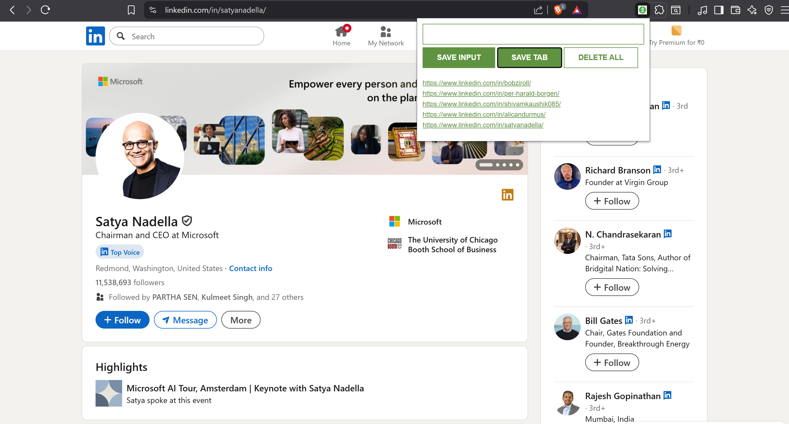

# Leads Tracker Chrome Extension  

A simple Chrome extension that helps you save and manage important website links (leads) directly from your browser using local storage.  

## 🚀 Demo  
  

## ✨ Features  
- Save links manually or directly from the current tab  
- Stores data using browser’s local storage (no external DB required)  
- Delete individual links or clear all at once  
- Minimal and responsive design with HTML/CSS

## 🛠 Tech Stack  
- HTML  
- CSS  
- JavaScript (DOM manipulation, Local Storage API)  

